<h2>Compte rendu du devoir de synthese sur la technologie microservices, Angular et keycloak </h2>
<ol>
 <li><h4>Creation du micro service Customer-service pour la gestion des clients</h4></li>
 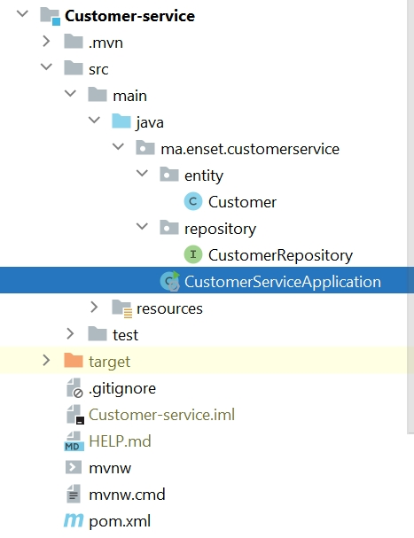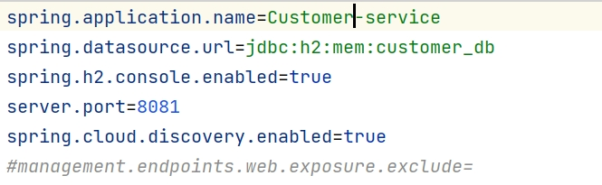
 <li><h4>Creation du micro service Inventory-service pour la gestion des produits</h4></li>
 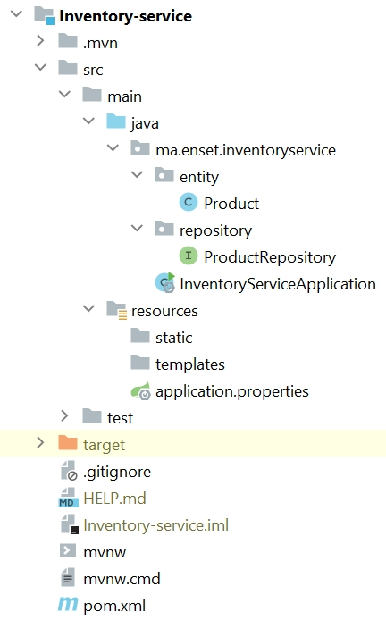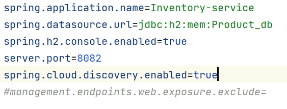
 <li><h4>Creation de la Gateway spring cloud gateway</h4></li>
 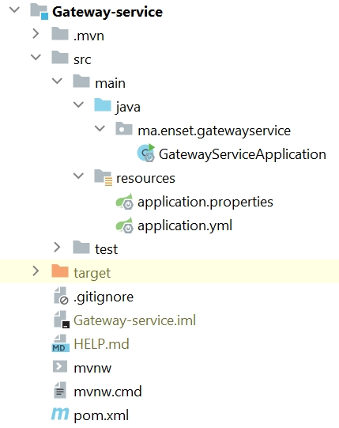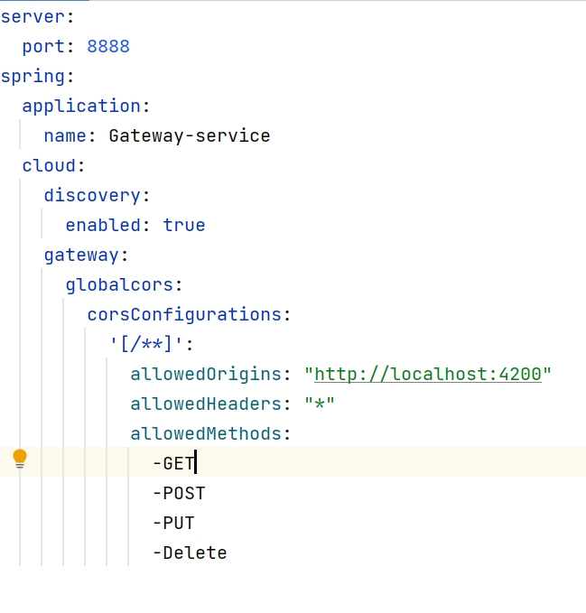
 <li><h4>Configuration static du système de routage</h4></li>
 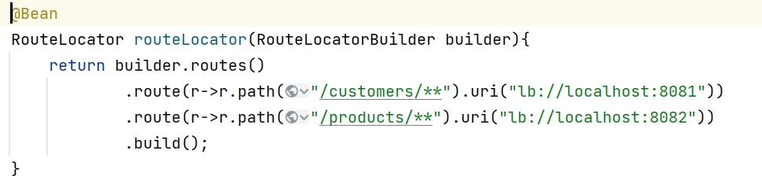
 <li><h4>Creation d'annuaire Eureka diskovery service</h4></li>
 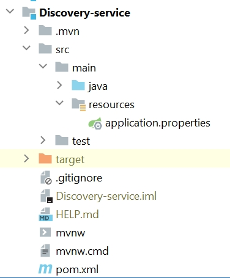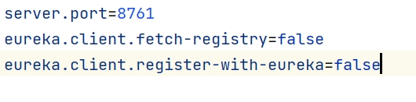
 <li><h4>Configuration dynamique des routes de la gateway</h4></li>
 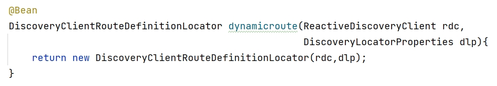
 <li><h4>Creation du service de facturation Billing service en utilisant Open Feign</h4></li>
 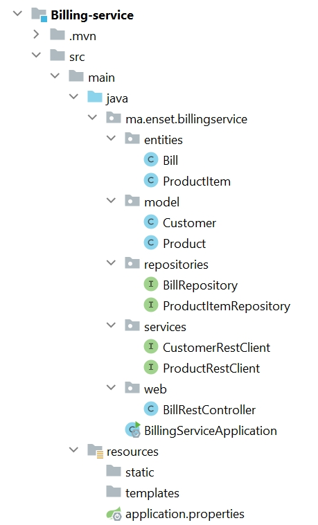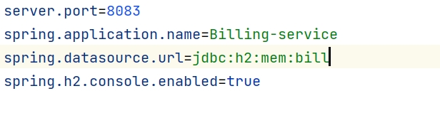
 <li><h4>Creation d'un client web Angular pour clients, produits, factures</h4></li>
 <li><h4>Deployement du service Keycloak</h4></li>
</ol>